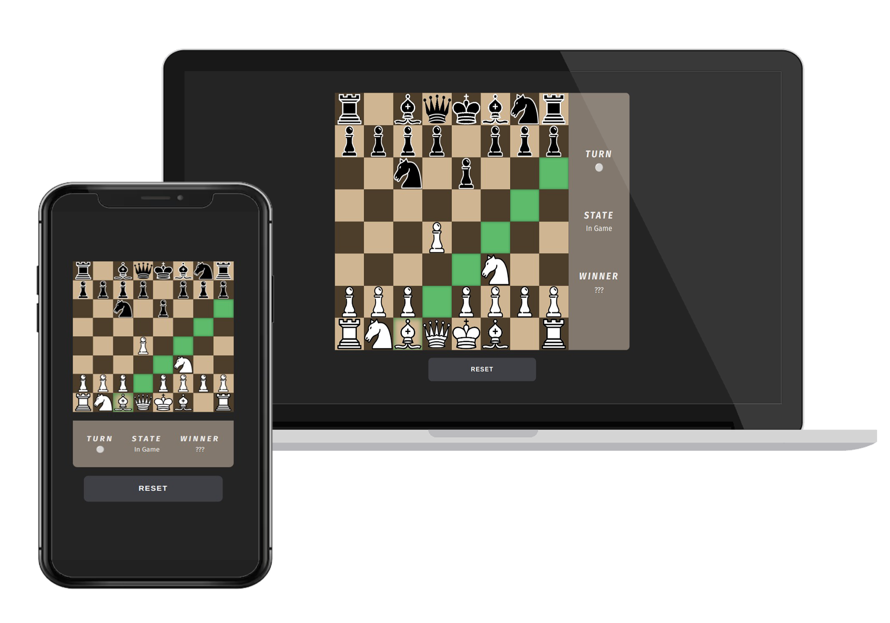

<h1 align="center">
  ♟️ Chess JS
</h1>

<p align="center">
    
</p>

[](https://forthebadge.com) &nbsp;


## Introduction

This project is a web application developed using **Vanilla Javascript**.

The original idea was to create a primarily *functional chess game* using vanilla javascript,
programming all the logic from scratch.

## Environment Requirements

To run this project, you need to have **Node.js** configured in your development environment. The specific requirements are as follows:

- Node.js

## Quick Installation

Follow these steps to set up and run the project in your local environment.

### Clone the Repository

Clone the repository to your local machine:

```bash
git clone https://github.com/raulv7z/nexus-play-proj.git
```

### Install Dependencies

Install and **Node.js** dependencies using npm:

```bash
npm install
```

## Running the Application

After completing the above steps, you can compile your assets and start the development server from Vite:

```bash
npm run dev
```

By default, the application will be available at http://localhost:5173.

For a production environment, use:

```bash
npm run build
```

## Considerations

In case of any inconvenience or doubt, please contact me at [rmm0.office@gmail.com](mailto:rmm0.office@gmail.com).

## License
Chess JS © 2024 by raulv7z is licensed under CC BY-NC-ND 4.0.

For more details, please refer to the [license terms](http://creativecommons.org/licenses/by-nc-nd/4.0/) or the [LICENSE](https://github.com/raulv7z/chess-js/blob/main/LICENSE) file.

[](https://creativecommons.org/licenses/by-nc-nd/4.0/)